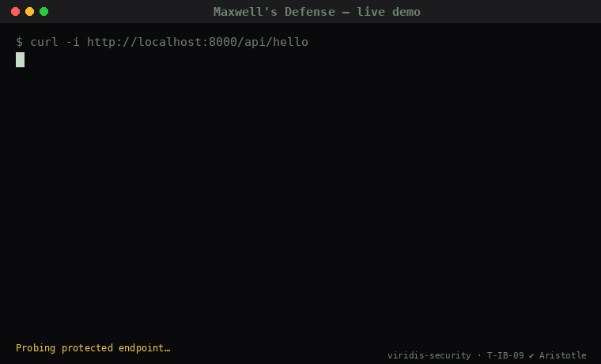

# Maxwell's Defense

**Adaptive proof-of-work defense for AI agents.** Attackers dissipate energy; defenders verify in O(1).

Apache-2.0. Maintained by [Viridis Security](https://github.com/viridis-security).

[](https://github.com/viridis-security/maxwells-defense/actions/workflows/ci.yml)
[](LICENSE)
[](THEOREMS.md)
[](THEOREMS.md#t-ib-09--adversarial-dissipation-theorem)



---

## The asymmetry

The defender hashes a candidate solution **once** and counts leading zero bits. The attacker pays an expected **2^d** hashes to find a solution at difficulty `d`. Verification cost is constant; attack cost is exponential.

That asymmetry is the operational expression of **T-IB-09 (Adversarial Dissipation Theorem)** in the Intelligence Bound corpus — Aristotle-verified 2026-05-10, 4/4 theorems mechanically proved under standard axioms. T-IB-09 establishes the formal claim: an attacker capturing N bits under amplification factor `M` dissipates at least `N · M · k_B · T · ln 2` joules, vs. the unprotected Landauer baseline of `N · k_B · T · ln 2`. The corollary (T-IB-09d, attack-irrationality threshold) defines when attack becomes thermodynamically irrational. The companion result T-IB-02 (Adversarial Landauer Inequality, formalization in progress) frames the same asymmetry against statistical detection. The formal statements live in [THEOREMS.md](THEOREMS.md).

The pitch in one sentence: **submission inboxes flooded with AI-generated reports? Put Maxwell's Defense at the gate; the spam now pays the energy bill, not your triagers.**

## In thirty seconds

```bash
pip install maxwells-defense
```

```python
from fastapi import FastAPI
from maxwells_defense.middleware import FastAPIMaxwellMiddleware
from maxwells_defense.core import StaticDifficultyOracle
import secrets

app = FastAPI()
app.add_middleware(
    FastAPIMaxwellMiddleware,
    server_secret=secrets.token_bytes(32),
    difficulty_oracle=StaticDifficultyOracle(difficulty=18),
    protect_path_prefix="/api/",
)

@app.get("/api/hello")
def hello():
    return {"ok": True}
```

That's it. Any client hitting `/api/*` now receives a 401 with a Maxwell challenge until they spend a few hundred milliseconds of CPU to solve it. JS reference client:

```js
import { fetchWithMaxwell } from "@viridis-security/maxwells-defense";

const res = await fetchWithMaxwell("/api/hello");
console.log(await res.json()); // { ok: true }
```

## What's in the box

```
python/                    Reference server implementation (Apache-2.0)
  maxwells_defense/
    core.py                Challenge / Solution / issue / verify / solve
    middleware.py          FastAPI/Starlette + WSGI shims
    failure_history.py     Bounded per-peer/context local failure counters
    errors.py              Exception hierarchy
  tests/test_invariants.py 17 invariant tests — all green
  tests/test_replay.py     Single-use, bounded-state and middleware regressions
  tests/test_signals.py    Transport identity and adaptive-signal regressions

javascript/                Reference client + Node server (Apache-2.0)
  src/maxwell.mjs          Browser/agent solver; fetchWithMaxwell() wrapper
  src/maxwell-express.mjs  Node Express middleware
  tests/interop.test.mjs   JS↔Python wire-format interop test
  tests/replay.test.mjs    Single-use and Express regressions
  tests/signals.test.mjs   Transport identity and adaptive-signal regressions

examples/                  Drop-in integrations
  express-middleware/      Minimal Node example
  fastapi-middleware/      Minimal Python example
  docker-compose-demo/     `docker compose up` → see PoW gate working

docs/
  integration.md           Production checklist (secrets, rotation, tuning)

THEOREMS.md                Formal mapping to the Intelligence Bound corpus
CONTRIBUTING.md            How to file bugs, ideas, rule contributions
LICENSE                    Apache-2.0
```

## Invariants this library commits to

Each invariant has a named regression test. If any of them stops holding, the library is broken — file an issue.

| ID         | Invariant                                                                 |
| ---------- | ------------------------------------------------------------------------- |
| MX-INV-1   | Verification cost is O(1) in difficulty (one HMAC, one SHA-256, one bit-count). |
| MX-INV-2   | Solution cost is O(2^d) expected for difficulty `d` leading-zero bits.    |
| MX-INV-3   | Challenges are HMAC-bound to (server_nonce, difficulty, expiry, context). Any tamper is rejected. |
| MX-INV-3a  | Expired challenges are rejected.                                          |
| MX-INV-3b  | Context-id mismatch at verify time is rejected.                           |
| MX-INV-4   | No exploit code path. Public API is lexically free of `attack_*`, `exploit_*`, `bypass_*`, etc. (lint-enforced.) |
| MX-INV-5   | Difficulty oracle is pluggable. The library never hard-codes a policy.    |
| MX-INV-6   | Middlewares accept a server nonce once before expiry; low-level verification opts in with a nonce store. See [single-use tests](python/tests/test_replay.py) and [deployment requirements](docs/integration.md#single-use--multi-process-state). |

## Why not just Cloudflare Turnstile / hCaptcha / mCaptcha?

Use them. They're great at what they do — keeping human visitors past a single-shot human-vs-bot test. Maxwell's Defense addresses a different surface:

- **Pluggable difficulty with local signals.** Middleware supplies the transport peer address, request method/path, failed-solution count, and history saturation flag. Difficulty stays static by default. Opt in to the capped `FailedAttemptDifficultyOracle` example or provide your own rule; this reference does not classify agents or learn from cross-site traffic. Optional context factories can bind challenges to the peer or an identity your application has established. See the [context and adaptive-signal guide](docs/integration.md#4-context-binding-and-local-signals) and [regression tests](python/tests/test_signals.py).
- **Self-hostable, no required third-party dependency.** Apache-2.0. Drop the middleware into your own service, deploy your own secret. The default implementation makes zero outbound calls; an explicitly configured Redis nonce store connects to your shared backend.
- **Open protocol surface.** Every challenge ships `X-Maxwell-Provider` and `X-Maxwell-Challenge` headers so clients and logs can identify the gate. Hosted receipt integration is separate from this reference and requires its own implementation and service-access checks.
- **Theorem-backed.** The asymmetry isn't a heuristic — it's a corpus invariant. See [THEOREMS.md](THEOREMS.md).

## Reference vs. production

This repository ships the **reference primitive**: SHA-256 hashcash, the simplest construction that exhibits the T-IB-09 asymmetry mechanically. It is sufficient for most deployments and is the canonical wire-format implementation.

The **hosted Viridis Maxwell** service (`mcp.viridis-security.com/v1/maxwell/*`) is a separate implementation. Its advertised design includes:

- **Argon2id-PoW** instead of reference SHA-256.
- **Amplification levels** (`low`/`medium`/`high`/`extreme`).
- **Dissipation receipts** and decoy infrastructure.

The hosted implementation, parameters, receipt lifecycle, and account entitlements have not been confirmed by this reference's tests. Its [parent SDK documentation](https://github.com/viridis-security/mcp-services-sdk/blob/main/services/maxwell/README.md) requires access to that repository. The reference is not feature-equivalent to hosted Maxwell.

**Use Maxwell locally:** install the Apache-2.0 reference and follow [the example above](#in-thirty-seconds). For hosted access, ask [Viridis Security](mailto:viridissecurity1@gmail.com) to confirm Maxwell endpoint access and plan limits before integrating. A free scan-service account does not establish Maxwell challenge-generation access.

## Status

`0.1.0` — alpha. The primitive is small (~250 LOC of crypto in core), tested across two languages, with proven wire-format interop. We expect breaking changes in 0.x while we add the federated-difficulty oracle and signed-receipt flow. Pin to a specific version in production.

## Testing

See the [version-pinning and typing guide](docs/integration.md#10-version-pinning-and-typing) for exact 0.x dependency pins and the Python typing marker.

```bash
# Python (17 original invariant tests plus single-use regressions)
cd python && pip install -e ".[test]" && pytest tests/ -v

# JS↔Python interop
cd javascript && node tests/interop.test.mjs
node tests/replay.test.mjs
node tests/http.test.mjs
node tests/signals.test.mjs
```

## Contributing

We want difficulty-oracle rules from real-world deployments. See [CONTRIBUTING.md](CONTRIBUTING.md).

## License

Apache License 2.0 — see [LICENSE](LICENSE).

The corpus theorems referenced in this README ([Intelligence Bound corpus](https://github.com/viridis-security/vulncanon)) are research artifacts under the same license terms.

---

*If your AI-triaged inbox is buried in scanner-output reports, talk to us. We built the upstream layer.*
